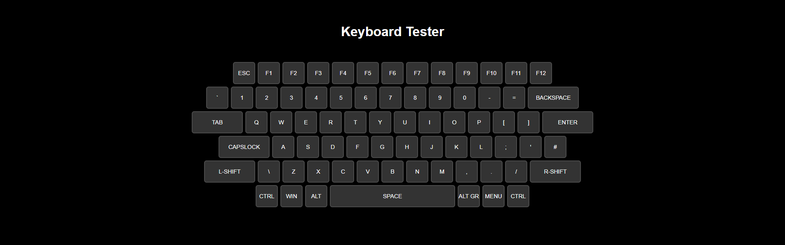

# Keyboard Tester

A lightweight browser-based keyboard tester that highlights keys as they are pressed. It renders an ISO-style keyboard layout and supports modifier keys, function keys, navigation keys, and the space bar.

## Features

- Visual keyboard layout with labeled keys
- Highlights pressed keys in real time
- Supports left and right modifier keys independently
- Runs entirely in the browser with no dependencies or build step
